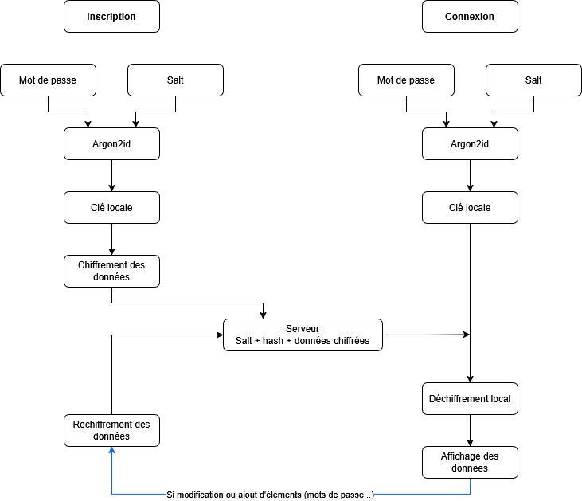

# Whitepaper  

## Concept Métier 

Locksy est un gestionnaire de mots de passe moderne et ultra‑sécurisé. Il permet aux utilisateurs de stocker et gérer leurs identifiants, notes et cartes bancaires dans un coffre chiffré, accessible uniquement par eux. Le serveur n’a jamais connaissance des clés de chiffrement, garantissant une confidentialité totale. 
 

## Donnée Critique 

La donnée critique que nous protégeons est l’ensemble des mots de passe des comptes utilisateurs. À cela s’ajoutent des informations sensibles comme les cartes bancaires, les notes sécurisées ou encore les documents. Ces données sont considérées comme hautement confidentielles et doivent rester inaccessibles à toute personne autre que l’utilisateur. 

Failles possibles : Pour la protection contre le bruteforce il faut être vigilant sur le calibrage d’Argon d’autant qu’un attaquant pourrait lancer un bruteforce hors ligne. 


## Schéma de Chiffrement 

### Inscription : 

- L’utilisateur saisit son mot de passe maître. 

- Un salt aléatoire unique est généré côté client. 

- Le mot de passe + salt passent dans Argon2id (fonction de dérivation de clé mémoire dur). 

- Cela produit une clé locale. 

- Le serveur stocke uniquement : email, salt, et le hash Argon2id du mot de passe. 

- La clé locale n’est jamais transmise au serveur. 

### Connexion : 

- Le serveur renvoie le salt associé à l’utilisateur. 

- Le client régénère la clé locale avec Argon2id (mot de passe + salt). 

- Cette clé locale sert à déchiffrer les données chiffrées reçues du serveur. 

- Le serveur ne fait que vérifier le hash pour authentifier l’utilisateur, sans jamais voir la clé ni les données en clair. 

### Chiffrement des données sensibles : 

- La clé locale dérivée est utilisée pour générer une clé maître. 

- Cette clé maître chiffre toutes les données sensibles avec AESGCM côté client. 

- Le serveur ne stocke que des blobs chiffrés (BYTEA), jamais les données en clair. 


## Preuve Zero‑Knowledge 

- La clé locale est toujours calculée côté client et n’est jamais envoyée au serveur. 

- Le serveur ne stocke que des hashs et des blobs chiffrés. 

- Même en cas de compromission du serveur, les données restent inexploitables sans le mot de passe maître de l’utilisateur. 


## Le Schéma de Chiffrement 




## Sécurité Client-Side (Front-End)

TODO : 
Justifiez vos choix de paramètres pour Argon2, présentez la structure de données versionnée que vous allez stocker, et décrivez votre plan de défense complet contre les attaques XSS.


## Sécurité Back-End

TODO :
1. La Validation des Données : Expliquez comment vous utilisez les DTOs et les `ValidationPipes` dans NestJS pour filtrer strictement les entrées.
2. La Stratégie Anti-Injection : Démontrez que vos requêtes (SQL ou NoSQL) sont immunisées contre les injections (utilisation de l'ORM, requêtes paramétrées…) et expliquez pourquoi.
3. Gestion des Uploads (si applicable) : Si votre projet permet l'upload de fichiers, décrivez les mesures prises (renommage UUID, stockage hors racine, validation…).

=> Votre Whitepaper doit prouver que votre application est construite avec le principe de Security by Design, et non sécurisée après coup.


## Authentficiation & sécurité des accès

TODO :
1. Politique de Mots de Passe : Documentez l'algorithme choisi (bcrypt/argon2) et le coût paramétré (ex: salt rounds). Expliquez pourquoi ce coût est un bon équilibre pour votre infra.
2. Architecture d'Authentification :
    * Incluez un schéma explicatif de votre flux (Login -> Création JWT -> Stockage Cookie/LocalStorage -> Vérification Guard).
    * Justifiez le choix du mode de stockage (ex: "Nous utilisons des cookies HttpOnly pour prévenir le vol de token via XSS, contrairement au LocalStorage qui est accessible par tout script JS").
3. Matrice des Rôles (RBAC) : Listez les types d'utilisateurs de votre système (ex: Visiteur, Utilisateur Standard, Admin, Modérateur).


## Sécurité de l'infrastructure

TODO :
1. Configuration CORS : Montrez votre configuration NestJS et expliquez pourquoi vous avez restreint les origines (quels domaines sont autorisés et pourquoi).
2. En-têtes HTTP : Listez les headers activés par Helmet dans votre projet et choisissez-en deux (ex: HSTS et X-Frame-Options) pour expliquer concrètement contre quelle attaque ils vous protègent.
3. Gestion des Secrets :
    * Preuve (screenshot de votre `.gitignore` ou structure de projet) que le fichier `.env` n'est pas versionné.
    * Exemple de code montrant l'utilisation du `ConfigService` pour injecter une variable sensible.


/!\ Livrable technique :
* Installation et activation de `helmet` dans `main.ts`.
* Configuration explicite de `enableCors` (pas de `origin: *`).
* Utilisation de `@nestjs/config` pour lire les variables d'environnement.


## Audit de sécurité et industrialisation

1. Le Rapport d'Audit Automatisé :
    * Une capture d'écran du résultat de la commande npm audit sur votre projet.
    * Si des vulnérabilités existent mais ne peuvent pas être corrigées (faux positifs ou dépendances dev), fournissez une courte justification.
2. L'Automatisation (CI/CD) :
    * Présentez le script (Github Action ou commande package.json) que vous avez mis en place pour automatiser les tests de sécurité.
    * Expliquez votre politique de blocage (ex: "Nous bloquons tout commit si une faille critique est détectée").
3. L'Auto-Critique (OWASP) :
    * Sélectionnez 3 points du TOP 10 OWASP.
    * Pour chaque point, expliquez en une phrase comment votre architecture NestJS le respecte (ex: "Injection SQL : Nous utilisons TypeORM qui sépare strictement les données de la requête via des placeholders, rendant l'injection impossible").
    * https://owasp.org/Top10/fr/A00_2021_Introduction/
4. Stratégie de Logs :
    * Montrez un exemple concret de log généré par votre application (lors d'un login ou d'une erreur).
    * Prouvez que ce log est "propre" (anonymisé, pas de mot de passe en clair).

/!\ Livrable technique :
* Votre repository doit contenir un script npm run security (ou équivalent) fonctionnel.
* Le projet final ne doit contenir aucune vulnérabilité critique non justifiée dans npm audit.

### Rapport d'audit automatisé

```
npm audit
```
[insérer la capture d'écran du résultat]


### Automatisation CI/CD 
Nous bloquons les merge request tant que le code ne compile pas et n'est pas propre, et tant qu'il ne passe pas l'audit de sécurité.

```
name: Code Quality Check
on:
  pull_request:
    branches:
      - main
jobs:
  check:
    runs-on: ubuntu-latest
    steps:
      - name: Checkout code
        uses: actions/checkout@v4
      - name: Use Node.js 20
        uses: actions/setup-node@v4
        with:
          node-version: "20"
      - name: Install dependencies
        run: npm install
      - name: Lint (ESLint)
        run: npm run lint
      - name: Build the project
        run: npm run build
```
Ce script se déclenche lorsqu'une merge request est ouverte pour la branche main, il vérifie que le code compile sans erreur, et que le linter Eslint ne renvoie pas d'erreur.

```
name: Security Audit
on:
  push:
  pull_request:
jobs:
  audit:
    runs-on: ubuntu-latest
    steps:
      - uses: actions/checkout@v3
      - name: Install Node
        uses: actions/setup-node@v3
        with:
          node-version: 18
      - name: Install dependencies
        run: npm ci
      - name: Run npm audit
        run: npm audit --audit-level=high
```
Ce script se déclenche également lors d'une pull request et vérifie qu'il n'y ait pas de failles de sécurité grâce à la commande `npm audit`.

### Autocritique - OWASP

1. OWASP
2. OWASP
3. OWASP
