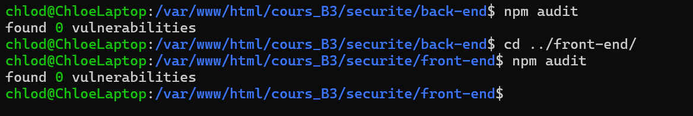

# Whitepaper  

## Concept Métier 

Locksy est un gestionnaire de mots de passe moderne et ultra‑sécurisé. Il permet aux utilisateurs de stocker et gérer leurs identifiants, notes et cartes bancaires dans un coffre chiffré, accessible uniquement par eux. Le serveur n’a jamais connaissance des clés de chiffrement, garantissant une confidentialité totale. 
 

## Donnée Critique 

La donnée critique que nous protégeons est l’ensemble des mots de passe des comptes utilisateurs. À cela s’ajoutent des informations sensibles comme les cartes bancaires, les notes sécurisées ou encore les documents. Ces données sont considérées comme hautement confidentielles et doivent rester inaccessibles à toute personne autre que l’utilisateur. 

Failles possibles : Pour la protection contre le bruteforce il faut être vigilant sur le calibrage d’Argon d’autant qu’un attaquant pourrait lancer un bruteforce hors ligne. 


## Schéma de Chiffrement 

### Inscription : 

- L’utilisateur saisit son mot de passe maître. 
- Un salt aléatoire unique est généré côté client. 
- Le mot de passe + salt passent dans Argon2id (fonction de dérivation de clé mémoire dur). 
- Cela produit une clé locale. 
- Le serveur stocke uniquement : email, salt, et le hash Argon2id du mot de passe. 
- La clé locale n’est jamais transmise au serveur. 


### Connexion : 

- Le serveur renvoie le salt associé à l’utilisateur. 
- Le client régénère la clé locale avec Argon2id (mot de passe + salt). 
- Cette clé locale sert à déchiffrer les données chiffrées reçues du serveur. 
- Le serveur ne fait que vérifier le hash pour authentifier l’utilisateur, sans jamais voir la clé ni les données en clair. 


### Chiffrement des données sensibles : 

- La clé locale dérivée est utilisée pour générer une clé maître. 
- Cette clé maître chiffre toutes les données sensibles avec AESGCM côté client. 
- Le serveur ne stocke que des blobs chiffrés (BYTEA), jamais les données en clair. 


## Preuve Zero‑Knowledge 

- La clé locale est toujours calculée côté client et n’est jamais envoyée au serveur. 
- Le serveur ne stocke que des hashs et des blobs chiffrés. 
- Même en cas de compromission du serveur, les données restent inexploitables sans le mot de passe maître de l’utilisateur. 


## Le Schéma de Chiffrement 


## Sécurité Front-End

### Choix des paramètres Argon2

Nous utilisons **Argon2id** côté client pour dériver la clé maître à partir du mot de passe. Les paramètres retenus sont :

- `memoryCost = 65 536` (≈64 MiB) → résistance mémoire contre GPU/ASIC
- `timeCost = 3` → durée de calcul renforçant la sécurité
- `parallelism = 1` → exécution adaptée aux navigateurs courants

Ce réglage offre un bon compromis entre sécurité et performance, avec possibilité d’ajustement ultérieur.

### Structure de données versionnée (enveloppe JSON)

Chaque objet chiffré est stocké sous forme de JSON auto-descriptif et versionné, incluant la recette cryptographique :
```
version: 1 → numéro de version du format
kdf: { alg: 'argon2id', params: { m, t, p, hashLen } } → algorithme et paramètres de dérivation
encryption: { alg: 'aes-256-gcm', tagBits } → algorithme de chiffrement et taille du tag
salt_b64: base64(salt) → sel utilisé pour Argon2id
aad_json: métadonnées en JSON → contexte (email, created_at, kdf)
data_b64: base64(nonce || ciphertext) → données chiffrées avec nonce
```

Cette structure garantit l’évolutivité : le front vérifie `version` avant déchiffrement, ce qui permet de changer d’algorithme ou de paramètres sans casser les anciens enregistrements.

### Plan de défense contre les attaques XSS

- **Échappement natif React** : React échappe automatiquement le contenu inséré via JSX, réduisant fortement les risques d’injection.
- **Sanitization** : utilisation de **DOMPurify** pour nettoyer tout HTML provenant d’utilisateurs ou d’extensions.
- **Subresource Integrity (SRI) et verrouillage des versions** : nous n’utilisons pas de CDN dynamiques ; toutes les dépendances sont fixées via package.json et package-lock.json pour éviter l’introduction de code corrompu.
- **Content Security Policy (CSP)** : gérée côté **back-end**, elle impose une politique stricte limitant l’exécution de scripts externes.
- **Stockage sécurisé des tokens** : utilisation de cookies HttpOnly pour empêcher l’accès par JavaScript en cas d’injection.


## Sécurité Back-End

### Validation des Données

Nous utilisons des DTOs (Data Transfer Objects) pour définir strictement la structure des données entrantes dans nos contrôleurs NestJS. Le ValidationPipe global appliqué dans `main.ts` valide automatiquement ces DTOs en utilisant des décorateurs comme `@IsEmail`, `@IsString`, etc., rejetant toute entrée non conforme avant qu'elle n'atteigne la logique métier.

### Stratégie Anti-Injection : 

Toutes nos requêtes SQL utilisent TypeORM, un ORM qui paramètre automatiquement les requêtes, séparant les données des commandes SQL via des placeholders. Cela rend les injections SQL impossibles car les entrées utilisateur ne sont jamais concaténées directement dans les requêtes.

### Security by Design

Notre application est construite avec le principe Security by Design : la sécurité est intégrée dès la conception, avec validation des entrées, ORM pour les requêtes, et chiffrement end-to-end, plutôt que d'ajouter des mesures après coup.


## Authentificiation & sécurité des accès

### Politique de mots de passe

#### Côté front

Nous utilisons **Argon2id** côté client comme KDF pour dériver la clé maître à partir du mot de passe. Côté serveur, seul le *verifier* dérivé (hash) et le *salt* sont stockés.

Un estimateur de force (**zxcvbn**) est intégré côté client afin d’encourager l’utilisation de passphrases longues et robustes.

Un contrôle supplémentaire via **HaveIBeenPwned (HIBP)** est effectué pour détecter si le mot de passe apparaît dans des fuites publiques. En cas de résultat positif, l’utilisateur est invité (ou contraint, selon la politique) à choisir un mot de passe inédit.

Les paramètres choisis (`memoryCost = 65 536`, `timeCost = 3`, `parallelism = 1`) représentent un compromis optimal :
- **Sécurité** : ils ralentissent fortement les attaques hors-ligne, en particulier celles menées avec GPU ou ASIC.
- **Performance** : ils restent suffisamment rapides pour garantir une expérience fluide dans le navigateur.

#### Côté back

Nous utilisons **bcrypt** pour le hachage des mots de passe côté client et serveur, avec un coût de 12 rounds. Ce coût offre un équilibre entre sécurité résistante au bruteforce hors ligne et performance acceptable pour notre infrastructure, sans ralentir l'expérience utilisateur.

### Flux d’authentification

#### Côté front

```
[Utilisateur navigateur]
1 • Saisie email + mot de passe
2 • Client : dérive masterKey avec Argon2id(password, salt)
3 • Client : chiffre une preuve/enveloppe (AES-GCM + AAD)
4 • POST /auth/login { email, password_hash_b64, envelope }

[Serveur API]
5 • Vérifie le payload et le hash ; si valide :
    - génère accessToken (JWT courte durée)
    - crée cookie Refresh Token (HttpOnly)
6 • Réponse : { accessToken, user }
→ accessToken stocké uniquement en mémoire côté front

[Client session]
7 • Axios intercepte les requêtes et ajoute Authorization: Bearer <accessToken>
8 • À l’expiration de l’accessToken :
    - POST /auth/refresh
    - navigateur envoie automatiquement le cookie HttpOnly (refresh)
    - serveur renvoie un nouvel accessToken, stocké en mémoire

[Guard / Protection des routes]
- RequireAuth lit le contexte Auth (isAuthenticated, initializing)
- Si non authentifié → redirection vers /login
- Si authentifié → accès au dashboard
```

#### Côté back

* Flux back-end : Login -> Vérification hash mot de passe -> Création JWT (access + refresh) -> Stockage en cookies `HttpOnly` -> Guards vérifient JWT sur routes protégées.
* Nous utilisons des cookies `HttpOnly` pour stocker les tokens JWT, prévenant le vol via XSS contrairement au LocalStorage accessible par tout script JS.

### Choix du mode de stockage des tokens

- **Refresh tokens** : stockés dans des **cookies HttpOnly + Secure + SameSite**.
→ Ils ne sont jamais accessibles via `document.cookie` et sont envoyés automatiquement par le navigateur lors des requêtes vers le domaine.

- **Access tokens** : conservés uniquement **en mémoire** (via l’état React).
→ Cela évite toute exposition permanente dans `localStorage` ou `sessionStorage`, qui sont accessibles par des scripts en cas d’attaque XSS.

Ce modèle, implémenté dans l’`AuthProvider`, combine sécurité (protection contre XSS et vol de tokens) et praticité (renouvellement automatique via interceptor).

### Rôles utilisateur

Pour le moment dans notre MVP, nous n'avons qu'un seul type d'utilisateur : l'utilisateur standard qui s'inscrit et se connecte. Techniquement il existe aussi le simple visiteur qui ne peut accéder qu'à la page d'accueil / d'inscription, et qui devient utilisateur aussitôt qu'il est inscrit.  


## Sécurité de l'infrastructure

Notre configuration NestJS restreint les origines à l'URL de l'API front uniquement, rejetant toute autre origine. Cela empêche les attaques CSRF et limite l'accès aux domaines de confiance, évitant les requêtes non autorisées depuis des sites malveillants.

Helmet active des headers comme Content-Security-Policy, HSTS, X-Frame-Options, X-Content-Type-Options, etc. HSTS force les connexions HTTPS, protégeant contre les attaques man-in-the-middle ; X-Frame-Options empêche le clickjacking en interdisant l'intégration dans des frames.

### Gestion des secrets :

Les fichiers `.env` sont ignorés par Git afin de ne pas se retrouver exposés en ligne.


#### Côté front

Côté front, les variables sensibles ne doivent pas être exposées. Seules les variables publiques (comme l’URL de l’API) sont injectées via le fichier `.env`.

Exemple :
```
VITE_API_URL={API_URL}
```

Cette valeur est ensuite utilisée par le code React/Vite pour configurer les appels réseau, sans jamais contenir de secrets.

#### Côté back
Exemple dans `main.ts` : `const port = configService.get<number>('NEST_PORT') || 3000;` et dans `auth.service.ts` : `secret: this.configService.get<string>('JWT_SECRET')`. Cela injecte les variables sensibles depuis `.env` sans les hardcoder.
Nous avons depuis géré les variables d'environnement avec Google Cloud Platform directement, donc sommes repassés sur l'utilisation de la syntaxe `process.env.VARIABLE`.


## Audit de sécurité et industrialisation

### Rapport d'audit automatisé

```
npm audit
```

Résultat de l'audit : Le projet ne contient aucune vulnérabilité critique non justifiée, car la vulnérabilité trouvée est dans une dépendance indirecte et est résolue par via `npm audit fix`.



### Automatisation CI/CD 

Nous bloquons les merge request tant que le code ne compile pas et n'est pas propre, et tant qu'il ne passe pas l'audit de sécurité.

```
name: Code Quality Check
on:
  pull_request:
    branches:
      - main
jobs:
  check:
    runs-on: ubuntu-latest
    steps:
      - name: Checkout code
        uses: actions/checkout@v4
      - name: Use Node.js 20
        uses: actions/setup-node@v4
        with:
          node-version: "20"
      - name: Install dependencies
        run: npm install
      - name: Lint (ESLint)
        run: npm run lint
      - name: Build the project
        run: npm run build
```
Ce script se déclenche lorsqu'une merge request est ouverte pour la branche main, il vérifie que le code compile sans erreur, et que le linter Eslint ne renvoie pas d'erreur.

```
name: Security Audit
on:
  pull_request:
    branches:
      - main
jobs:
  audit:
    runs-on: ubuntu-latest
    steps:
      - uses: actions/checkout@v3
      - name: Install Node
        uses: actions/setup-node@v3
        with:
          node-version: 18
      - name: Install dependencies
        run: npm ci
      - name: Run npm audit
        run: npm audit --audit-level=high
```
Ce script se déclenche également lors d'une pull request et vérifie qu'il n'y ait pas de failles de sécurité grâce à la commande `npm audit`.

Les variables d'environnement ne sont pas injectées par GitHub, nous utilisons directement la gestion des secrets via GCP.

### Autocritique - OWASP

1. Injection : Nous utilisons TypeORM pour les requêtes SQL afin de séparer les données via les placeholders et empêcher l'injection.
2. Authentification : Nous utilisons Argon2 dans le front et bcrypt dans le back afin de hacher les mots de passe. Argon2 permet de dériver la clé à partir du mot de passe maître, et ainsi le serveur n'a pas accès aux données.
3. Vulnérabilité: La commande `npm audit` ne révèle aucune vulnérabilité dans le projet. L'installation de l'ensemble des dépendances de versions récentes et sécurisées est un des exemples qui peux expliquer l'absence de vulnérabilité. 
